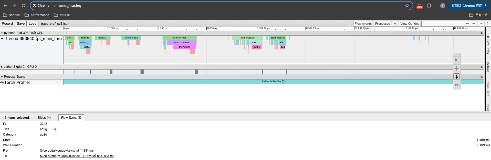

<!-- TOC -->

- [启动容器](#%E5%90%AF%E5%8A%A8%E5%AE%B9%E5%99%A8)
- [FLUX推理](#flux%E6%8E%A8%E7%90%86)
- [SD3推理](#sd3%E6%8E%A8%E7%90%86)
- [Pytorch Profiler](#pytorch-profiler)
- [推理显存分析](#%E6%8E%A8%E7%90%86%E6%98%BE%E5%AD%98%E5%88%86%E6%9E%90)
- [HTA分析](#hta%E5%88%86%E6%9E%90)

<!-- /TOC -->

<!-- /TOC -->

# 启动容器

- pull image

```sh
docker pull harbor.shopeemobile.com/aip/aip-image-hub/aip-prod/projects/123/pytorch2.5-cu12.6-py3.10-trt10.3:py3.10-cu12.6-pt2.5-trt10.3-vscode1.82.2-f6754f38f4
```

- start container

```sh
#!/bin/bash
# Run the docker container with the specified parameters

WORKSPACE_PATH="/home/fuping.chu"
C_NAME="fuping-flux"
FLAGS="-itd --privileged "
IMAGE_URL="harbor.shopeemobile.com/aip/aip-image-hub/aip-prod/projects/123/pytorch2.5-cu12.6-py3.10-trt10.3"
DATASETS="/home/fuping.chu/datasets"
MODEL_ZOO="/home/fuping.chu/model_zoo"

cmd="docker run -u root $FLAGS --name ${C_NAME} \
  --gpus all \
  --shm-size=16g \
  --net=host \
  -w /workspace \
  -v ${WORKSPACE_PATH}:/workspace \
  -v ${DATASETS}:/datasets \
  -v ${MODEL_ZOO}:/model_zoo \
  ${IMAGE_URL} bash"
echo $cmd
$cmd
```

- 安装依赖

```sh
cd /workspace/project_flux/x_flux
pip install -r requirements.txt
```

# FLUX推理

- 推理脚本

```py
import torch
from diffusers import FluxPipeline

model_path="/model_zoo/flux.1_dev/"
pipe = FluxPipeline.from_pretrained(model_path, torch_dtype=torch.bfloat16)
pipe.enable_model_cpu_offload()

prompt = "a tiny astronaut hatching from an egg on the moon"
out = pipe(
    prompt=prompt,
    guidance_scale=3.5,
    height=768,
    width=1360,
    num_inference_steps=50,
).images[0]
out.save("image.png")
```

- 运行脚本

```sh
python3 test_flux_diffusers.py 
```

# SD3推理

- 推理脚本

```py
import torch
from diffusers import FluxPipeline

model_path="/model_zoo/stable-diffusion-3-medium-diffuser/"
pipe = FluxPipeline.from_pretrained(model_path, torch_dtype=torch.bfloat16)
pipe.enable_model_cpu_offload()

prompt = "a tiny astronaut hatching from an egg on the moon"
out = image = pipe(
    prompt=prompt,
    negative_prompt="",
    num_inference_steps=50,
    height=768,
    width=1360,
    guidance_scale=3.5,
).images[0]
out.save("image.png")
```

- 运行脚本

```sh
python3 test_flux_sd3.py 
```

# Pytorch Profiler

- dump json
- 查看json

通过chrome查看。接口说明[地址](https://pytorch.org/docs/stable/generated/torch.autograd.profiler.profile.export_chrome_trace.html)。

本地浏览器打开：`chrome://tracing`，将文件拖入浏览器。示例



- 统计结果

执行分析脚本，按照耗时排序，拿到统计结果。

```sh
python trace_prof_statics.py --prof trace_prof_sd3.json --debug true | tee trace_prof_flux_analyze.txt
```

分析结果如下：

```txt
OpName                                             DeviceActiveTime                                   Calls                                              Percentage

aten::scaled_dot_product_attention                 311.836884765625                                   113                                                38.69%
aten::linear                                       170.9015185546875                                  1212                                               21.20%
aten::conv2d                                       99.3837109375                                      36                                                 12.33%
aten::group_norm                                   74.5154755859375                                   30                                                 9.25%
bubble                                             66.5094189453125                                   3695                                               8.25%
aten::add                                          21.122056640625                                    689                                                2.62%
aten::layer_norm                                   13.2539033203125                                   276                                                1.64%
aten::mul                                          10.4941083984375                                   490                                                1.30%
aten::cat                                          8.976181640625                                     84                                                 1.11%
aten::silu                                         8.7071669921875                                    80                                                 1.08%
aten::gelu                                         6.2585244140625                                    111                                                0.78%
aten::div                                          3.5844228515625                                    22                                                 0.44%
aten::add_                                         2.7373671875                                       50                                                 0.34%
aten::upsample_nearest2d                           2.297142578125                                     3                                                  0.29%
aten::matmul                                       1.9394599609375                                    96                                                 0.24%
FusedRMSNormAffineFunction                         0.9171591796875                                    98                                                 0.11%
aten::softmax                                      0.9124580078125                                    48                                                 0.11%
aten::tanh                                         0.4010673828125                                    48                                                 0.05%
aten::pow                                          0.3942744140625                                    48                                                 0.05%
aten::contiguous                                   0.3455693359375                                    48                                                 0.04%
aten::embedding                                    0.150017578125                                     12                                                 0.02%
aten::sigmoid                                      0.0705263671875                                    24                                                 0.01%
aten::reshape                                      0.0483203125                                       2                                                  0.01%
aten::to                                           0.035330078125                                     10                                                 0.00%
aten::index                                        0.0254736328125                                    4                                                  0.00%
aten::arange                                       0.0223681640625                                    13                                                 0.00%
aten::lt                                           0.0186259765625                                    6                                                  0.00%
aten::argmax                                       0.01715234375                                      4                                                  0.00%
aten::pad                                          0.0141123046875                                    2                                                  0.00%
aten::sub                                          0.01283203125                                      4                                                  0.00%
aten::clamp                                        0.0089931640625                                    1                                                  0.00%
aten::masked_fill_                                 0.0088642578125                                    4                                                  0.00%
aten::randn                                        0.0076484375                                       1                                                  0.00%
aten::full                                         0.007103515625                                     4                                                  0.00%
aten::nonzero                                      0.00665625                                         1                                                  0.00%
aten::where                                        0.005568359375                                     2                                                  0.00%
aten::min                                          0.005408203125                                     2                                                  0.00%
aten::abs                                          0.0049921875                                       2                                                  0.00%
aten::gt                                           0.0048642578125                                    2                                                  0.00%
aten::log                                          0.0048642578125                                    2                                                  0.00%
aten::full_like                                    0.0046083984375                                    2                                                  0.00%
aten::rsub                                         0.00313671875                                      2                                                  0.00%
aten::ones                                         0.0027841796875                                    2                                                  0.00%
aten::cos                                          0.0022724609375                                    1                                                  0.00%
aten::sin                                          0.0022080078125                                    1                                                  0.00%
aten::eq                                           0.002015625                                        1                                                  0.00%
aten::exp                                          0.0016640625                                       1                                                  0.00%
aten::zeros                                        0.0013759765625                                    1                                                  0.00%
total_device_time:  805.9876582031252 total_device_activate_time:  739.4782392578127 total_bubble_time:  66.5094189453125

Top 3 ops ['aten::scaled_dot_product_attention', 'aten::linear', 'aten::conv2d']
```

# 推理显存分析

利用[pytorch.org/memory_viz](https://pytorch.org/memory_viz)分析内存使用情况，详细说明请见[链接](https://pytorch.org/docs/stable/torch_cuda_memory.html)

- 增加代码

```python
# 这行代码放在import torch之后
torch.cuda.memory._record_memory_history(True)

# 这样代码放在执行完一次forward或者backward之后执行
snapshot = torch.cuda.memory._snapshot()

# 如果需要dump snapshot，这样代码也是在执行完一次forward或者backward之后执行
torch.cuda.memory._dump_snapshot("snapshot_of_flux.pickle")
```
- 浏览器查看timeline[地址](https://pytorch.org/memory_viz)


- 浏览器查看timeline[地址](https://pytorch.org/memory_viz)


- 转换为svg格式
```sh
# https://github.com/pytorch/pytorch/blob/master/torch/cuda/_memory_viz.py
python _memory_viz.py memory snapshot.pickle -o memory.svg
python _memory_viz.py segments snapshot.pickle -o segments.svg
```


# HTA分析