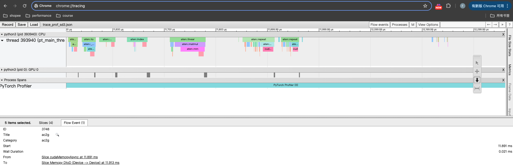

<!-- TOC -->

- [启动docker](#%E5%90%AF%E5%8A%A8docker)
- [显存情况分析](#%E6%98%BE%E5%AD%98%E6%83%85%E5%86%B5%E5%88%86%E6%9E%90)
- [耗时分析-nsys](#%E8%80%97%E6%97%B6%E5%88%86%E6%9E%90-nsys)
- [Pytorch Profiler](#pytorch-profiler)
- [HTA分析](#hta%E5%88%86%E6%9E%90)

<!-- /TOC -->

#  启动docker
```sh
# Run the docker container with the specified parameters
WORKSPACE_PATH="/home/fuping.chu"
C_NAME="fuping-flux"
FLAGS="-itd --privileged "
IMAGE_URL="harbor.shopeemobile.com/aip/aip-image-hub/aip-prod/projects/123/pytorch2.5-cu12.6-py3.10-trt10.3"
DATASETS="/home/fuping.chu/datasets"
MODEL_ZOO="/home/fuping.chu/model_zoo"

cmd="docker run -u root $FLAGS --name ${C_NAME} \
  --gpus all \
  --shm-size=16g \
  --net=host \
  -w /workspace \
  -v ${WORKSPACE_PATH}:/workspace \
  -v ${DATASETS}:/datasets \
  -v ${MODEL_ZOO}:/model_zoo \
  ${IMAGE_URL} bash"
echo $cmd
$cmd
```

- 安装依赖

```sh
python3 -m venv xflux_env
cd /workspace/project_flux/x_flux
pip install -r requirements.txt
```

# 显存情况分析

利用[pytorch.org/memory_viz](https://pytorch.org/memory_viz)分析内存使用情况，详细说明请见[链接](https://pytorch.org/docs/stable/torch_cuda_memory.html)

- 增加代码

```python
# 这行代码放在import torch之后
torch.cuda.memory._record_memory_history(True)

# 这样代码放在执行完一次forward或者backward之后执行
snapshot = torch.cuda.memory._snapshot()

# 如果需要dump snapshot，这样代码也是在执行完一次forward或者backward之后执行
torch.cuda.memory._dump_snapshot("snapshot_of_flux_train.pickle")
```

- 转换为svg格式
```sh
# https://github.com/pytorch/pytorch/blob/master/torch/cuda/_memory_viz.py
python _memory_viz.py memory snapshot_of_flux_train.pickle -o snapshot_memory.svg
python _memory_viz.py segments snapshot_of_flux_train.pickle -o snapshot_segments.svg
```


- 文件解析
    - 文件有点大，一个step有1.6g，解析会有点慢

# 耗时分析-nsys

利用nsystem分析模型在CUDA上耗时情况。

- dump脚本

```sh
#!/bin/bash 

ENV_PATH=/workspace/flux_env/master_env.sh
source $ENV_PATH
# DEVICES_ID=(0 1 4 5)
DEVICES_ID=(4 5)
WORLD_SIZE=${#DEVICES_ID[@]}
BATCH=1
ZERO_MODE=zero2

rank_id=0
for i in ${DEVICES_ID[@]}; do
    export CUDA_VISIBLE_DEVICES=$i
    export RANK=$rank_id
    if [ $RANK -eq 0 ];then
        echo "Running On GPU_$i, RANK_$RANK"
	#bash nsys.sh $i &
	nsys profile \
		-y 600 \
		-d 20 \
		--stats=true \
                -t cuda,osrt,nvtx \
		-o flux_timeline_${ZERO_MODE}_worker${WORLD_SIZE}_batch${BATCH}_$i \
    	        --gpu-metrics-devices=$i \
	      accelerate launch \
	     --num_processes $WORLD_SIZE \
	     --num_machines $WORLD_SIZE \
	     --machine_rank $RANK \
	     --main_process_ip $MASTER_ADDR \
	     --main_process_port $MASTER_PORT \
	     --deepspeed_multinode_launcher standard \
	     --use_deepspeed \
	     --mixed_precision bf16 \
	     train_flux_deepspeed.py --config 'train_configs/test_finetune.yaml' &
    else
            echo "Running On GPU_$i, RANK_$RANK"
        accelerate launch \
          --num_processes $WORLD_SIZE \
          --num_machines $WORLD_SIZE \
          --machine_rank $RANK \
          --main_process_ip $MASTER_ADDR \
          --main_process_port $MASTER_PORT \
          --deepspeed_multinode_launcher standard \
          --use_deepspeed \
          --mixed_precision bf16 \
          train_flux_deepspeed.py --config 'train_configs/test_finetune.yaml' &
    fi
    let rank_id+=1
done
wait

```

- 文件解析
    - 在笔记本上安装NVIDIA Nsight Systems UI客户端，打开.nsys-rep文件


# Pytorch Profiler
使用说明：[链接](https://pytorch.ac.cn/tutorials/intermediate/tensorboard_profiler_tutorial.html#use-profiler-to-record-execution-events)

- dump json
参考[官网示例](https://pytorch.org/docs/main/profiler.html)。
```python
# 定义一个分析函数
def trace_handler(prof):
    # 打印性能分析表，按CUDA时间总和排序，现实所有行
    print(prof.key_averages().table(
        sort_by="self_cuda_time_total", row_limit=-1))
    # 导出chrome trace文件
    prof.export_chrome_trace("trace_prof_flux_train_step_" + str(prof.step_num) + ".json")

# 这个代码加在for循环开始前
# schedule可以设置记录哪个step的性能
# wait=1表示跳过第一个step，不记录
# warmup=1表示在第二个step，warmp一次，不记录
# activae=1表示记录第三个step
# repeat=1，表示重复上述过程一次
with torch.profiler.profile(
    activities=[
        torch.profiler.ProfilerActivity.CPU,
        torch.profiler.ProfilerActivity.CUDA,
    ],
    schedule=torch.profiler.schedule(
    wait=1,
    warmup=1,
    active=1,
    repeat=1),
    on_trace_ready=trace_handler
# on_trace_ready=torch.profiler.tensorboard_trace_handler('./log')
# used when outputting for tensorboard
) as prof:
    code_to_profile;
```

- 查看json

通过chrome查看。接口说明[地址](https://pytorch.org/docs/stable/generated/torch.autograd.profiler.profile.export_chrome_trace.html)。

本地浏览器打开：`chrome://tracing`，将文件拖入浏览器。示例



- 统计结果

执行分析脚本，按照耗时排序，拿到统计结果。

```sh
python trace_prof_statics.py --prof trace_prof_sd3.json --debug true | tee trace_prof_flux_analyze.txt
```

分析结果如下：

# HTA分析
使用说明：[链接](https://hta.readthedocs.io/en/latest/index.html)
- 获取trace数据
- 安装HTA

```sh
pip install HolisticTraceAnalysis
```
- HTA分析

- 